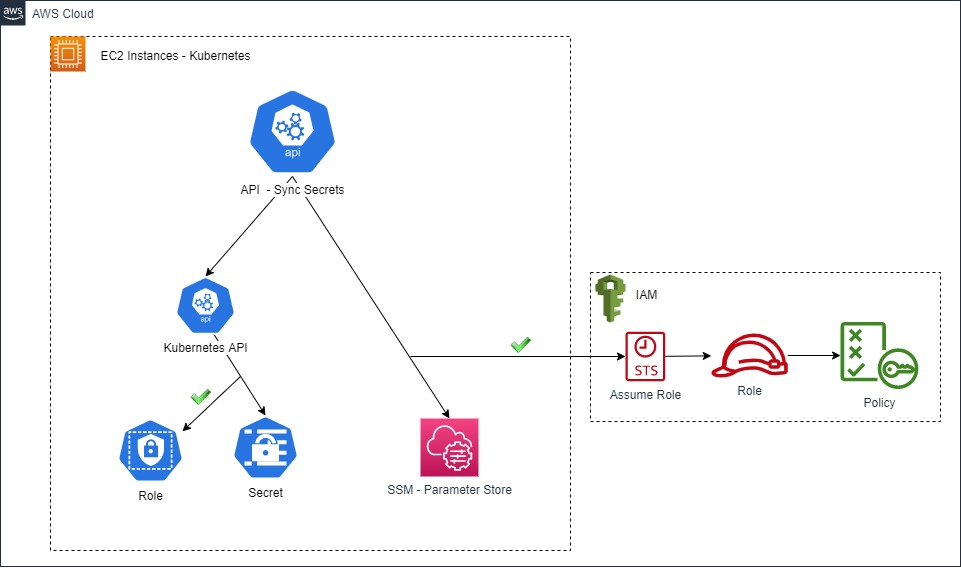

# Dumbledore - API Sync Kubernetes Secrets with AWS SSM

## About

Dumbledore are inspired by https://github.com/cmattoon/aws-ssm where the secrets are synchronized with AWS SSM Parameter Store in a loop. 
Sometimes in a large environment, we need update the secrets immediately instead wait for the loop. With this purpose, that project was created, to synchronize this specifics secrets by a API. Dumbledore has many secrets to handle.

## Workflow



## 💻 Requirements

| Environment Variables(required) | Default Value |
| ------------------------------- |:-------------:|
| SECRET_API_VERSION              | "v1"          |
| AWS_REGION                      | ""            |

#### Structure of secret annotations:
````
apiVersion: v1
kind: Secret
metadata:
  annotations:
    aws-ssm/aws-param-key: aws/ssm
    aws-ssm/aws-param-name: parameterStoreHere
    aws-ssm/aws-param-type: SecureString
  name: nameofsecret
  namespace: namespaceSecretHere
type: Opaque
data{}
````
A example can be found on example/secret.yaml

#### AWS permissions:
````
"ssm:GetParameter"
````

#### Kubernetes cluster permissions:
````
- apiGroups: [""]
  resources: ["secrets"]
  verbs: ["get", "list", "patch"]
````
#### Obs.: 
More informations in kubernetes folder.

Today the application are using AWS native assume role by EC2 instances, it needs be improved defining the assume role by application.

## Docker

#### Public Image:
````
docker pull gabrielmadrid/dumbledore:latest
````
Obs.: Default entrypoint run on port 80

#### Build:
````
docker build -t dumbledore .
````

## 🚀 Running
 
#### Local:

##### install packages:
````
pip install -r requirements.txt
````
##### Configure kubectl:
````
 - Comment parameter config.load_incluster_config() on main.py to run local
 - Configure kubernetes client config.load_kube_config(). Example: config.load_kube_config("~/.kube/kubeConfigFileHere")
````
##### execute:
````
uvicorn main:APP --host 0.0.0.0 --port 80
````

#### Kubernetes:

##### Individual resources

Execute the command below for each file inside folder kubernetes:
````
cd kubernetes
kubectl apply -f example.yaml
````
Obs.: Its necessary to configure your ingress to access the API outside the cluster

##### Helm v3:
Create namespace and configure the parameters of ./helm/values.yaml file before run the command below:
````
helm install -f ./helm/values.yaml dumbledore ./helm
````

## Endpoints

| Path/URI             | Function                |
| -------------------- |:-----------------------:|
| /api/v1/secrets/sync | Sync secrets            |
| /health-check        | Health Check            |

## Request

The API works with one namespace and the secrets that needs be synchronized in this namespace. 
For that, the json data are sent with parameters **namespace** as **String** and **secrets** as **List**.

#### Example of request:
````
curl -X POST -H 'application/json' -H 'Content-Type: application/json' -d '{"namespace": "default", "secrets": ["testando", "teste"]}' http://localhost/api/v1/secrets/sync
````
#### Expected response

````
{
  "secrets_updated":[
    "testando",
    "teste"
  ],
  "secrets_notfound": [],
  "secrets_error": [],
  "secrets_parameter_store_notfound": []
}
````

## ☕ GIT Flow

#### Flow:
| Branch    | Function                |
| --------- |:-----------------------:|
| master    | New releases - New tag  |
| develop   | Homologation            |
| others    | Development             |
