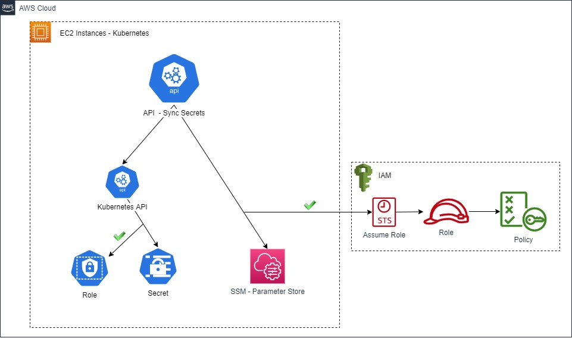

# Dumbledore - API Sync Kubernetes Secrets with AWS SSM

## About

Dumbledore are inspired by https://github.com/cmattoon/aws-ssm where the secrets are synchronized with AWS SSM Parameter Store in a loop. 
Sometimes in a large environment, we need update the secrets immediately instead wait for the loop. With this purpose, that project was created, to synchronize this specifics secrets by a API. Dumbledore has many secrets to handle.

## Workflow



## Docker

````
gabrielmadrid/dumbledore
````

## 💻 Requirements

````
Environment variables:
SECRET_API_VERSION - default value "v1"
AWS_REGION - default value ""
````
````
Structure of secret annotations:
apiVersion: v1
kind: Secret
metadata:
  annotations:
    aws-ssm/aws-param-key: aws/ssm
    aws-ssm/aws-param-name: parameterStoreHere
    aws-ssm/aws-param-type: SecureString
  name: nameofsecret
  namespace: namespaceSecretHere
data{}
````

## 🚀 Running
 
Local:
```
install packages:
pip install -r requirements.txt

execute:
uvicorn main:APP --host 0.0.0.0 --port 80
```

Kubernetes:
Create resources of kubernetes:
````
kubectl apply -f kubernetes/
````

## Request

Example of request:
````
curl -X POST -H 'application/json' -H 'Content-Type: application/json' -d '{"namespace": "default", "secrets": ["testando", "teste"]}' http://localhost/api/v1/secrets/sync
````

## ☕ GIT Flow

```
develop (tests) > master (released new version)
```